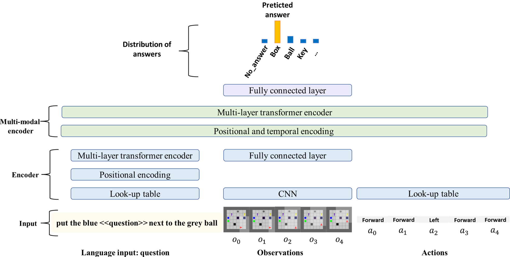
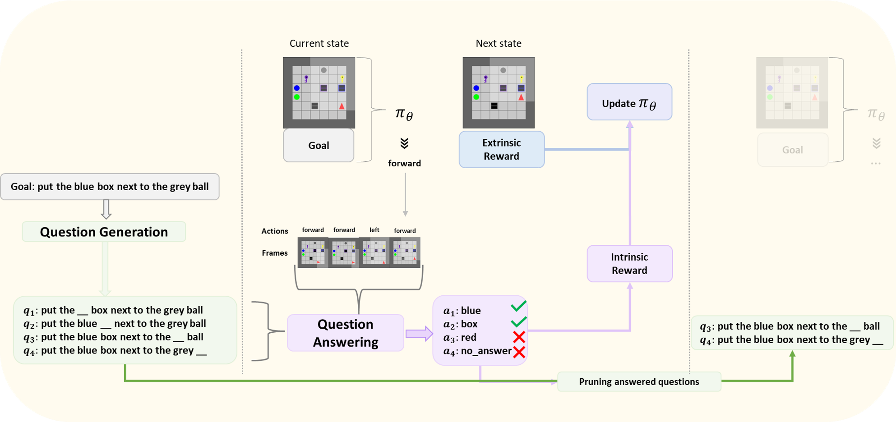

# EAGER: Asking and Answering Questions for Automatic Reward Shaping in Language-guided RL

**Abstract**:

Reinforcement learning (RL) in long horizon and sparse reward tasks is notoriously
difficult and requires a lot of training steps. A standard solution to speed up the
process is to leverage additional reward signals, shaping it to better guide the
learning process. In the context of language-conditioned RL, the abstraction and
generalisation properties of the language input provide opportunities for more
efficient ways of shaping the reward. In this paper, we leverage this idea and
propose an automated reward shaping method where the agent extracts auxiliary
objectives from the general language goal. These auxiliary objectives use a question
generation (QG) and question answering (QA) system: they consist of questions
leading the agent to try to reconstruct partial information about the global goal using
its own trajectory. When it succeeds, it receives an intrinsic reward proportional
to its confidence in its answer. This incentivizes the agent to generate trajectories
which unambiguously explain various aspects of the general language goal. Our
experimental study shows that this approach, which does not require engineer
intervention to design the auxiliary objectives, improves sample efficiency by
effectively directing exploration.

**Paper**:

[EAGER: Asking and Answering Questions for Automatic Reward Shaping in Language-guided RL](https://arxiv.org/abs/2206.09674)

## Installation
Clone this repository
```
git clone https://anonymous.4open.science/r/EAGER-FC2E/README.md
cd EAGER
```

Create a new environment and activate it

```
conda env create -f env.yml -n eager
conda activate eager
```

Install BabyAI and MiniGrid.

```
cd babyai
pip install -e .
cd ../gym-minigrid
pip install -e .
```

## Pretraining the QA module

The QA architecture is based on the [Episodic Transformer](https://github.com/alexpashevich/E.T.) architecture. Using multimodal transformers, the QA can direct its attention
over certain observations in the trajectory about the words used for the question and the previously
taken action. Thus we can train the QA over the full trajectory and use it on partial trajectories (up to
time step t) at test time.

# Generating demonstrations

**QA training data set**: To train the QA we generate a dataset constructed by mixing 4 tasks: Open-Large, PickUp-Large,
PutNextTo-Local, and Sequence-Medium. We use a bot provided with the BabyAI platform that
procedurally solves the environment. With it, we generate 7500 example trajectories for each task.
These trajectories are associated with questions among which some are not answerable. 

**Adding "no_answer" questions**: To train the QA to respond: "no_answer" and prevent it from
hazard-guessing the answer, we randomly associate certain paths and questions from unrelated
objectives. o generate these questions, for each new trajectory generated by the bot, we take a
goal among the last three used. If this goal differs from the goal used for the trajectory, we use it to create questions that are associated with "no_answer".

**Wide distribution of trajectories**: As explained in the experimental settings and empirically
demonstrated in the experiments, a broad distribution of trajectories improves the QA and the
efficiency of EAGER overall. To obtain such distribution from the procedural bot, we replace at
each time step with a probability p the action of the bot by a random action in: *turn right*, *turn
left*, *go forward*, *pick up*, *drop*. For each new example trajectory, we
randomly select p. More precisions are given in the Appendix B.


```
scripts/sample_runs/gen_demos/multienv_QG.sh
```

# Train the QA

<p align="center">
    
</p>

The QA architecture is based on the architecture of the [Episodic Transformer](https://github.com/alexpashevich/E.T.) Pashevich
et al. (2021). To predict the correct answer the QA model received a natural language question, visual
observations, and actions generated by the agent from the beginning of an episode (see Figure 8).
Here we show an example that corresponds to the 5th time step of an episode. After processing the
question with a transformer-based language encoder, embedding the observation with a convolutional
neural network CNN and passing actions through a look-up table, the agent outputs the correct answer.
During training, we use full trajectories. At test time, we ask all the questions in the active set of
questions using the current trajectory.


Train the QA on the mix of environment dataset.

```
scripts/sample_runs/train_QA/multienv_QA.sh
```

## RL training with EAGER

<p align="center">
    
</p>

During training, the agent uses the goal to generate relevant questions using its question-
generation module **QG**. Then, it attempts at answering them from current trajectories at each step
with its question-answering module **QA**, by looking at the trajectory. When it succeeds, it obtains an
intrinsic reward proportional to its confidence in its answer. Then it removes the answered questions
from the list of questions. This incentivizes the agent to produce trajectories that enable to reconstruct
unambiguously partial information about the general language goal, enabling to shape rewards and
guide learning.

For the PutNextTo setting in 1 room with QA trained to answer no_answer if necessary.

```
scripts/sample_runs/rl/pnl_QG_QA_no_answer.sh
```

## Acknowledgements

- [babyai](https://github.com/mila-iqia/babyai/tree/iclr19)
- [gym-minigrid](https://github.com/maximecb/gym-minigrid)
- [ELLA](https://github.com/Stanford-ILIAD/ELLA)
- [RIDE](https://github.com/facebookresearch/impact-driven-exploration)
- [Episodic Transformer](https://github.com/alexpashevich/E.T.)
